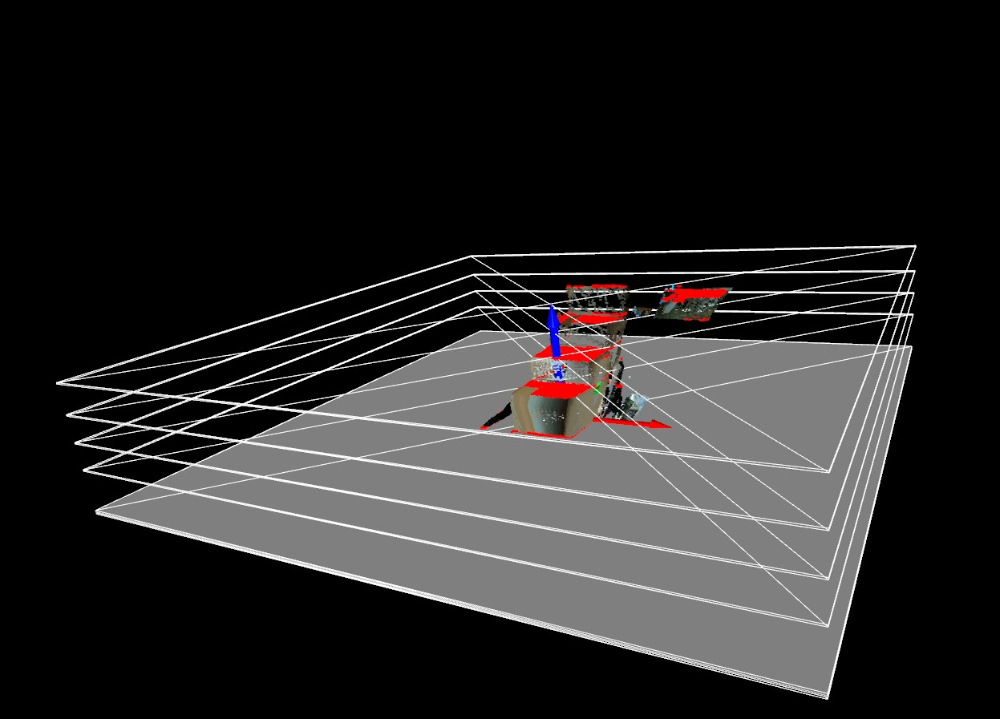

# 3DGraspingSystem

This project aims to implement a 3D object grasping system using data obtained from a 3D camera scan. The code processes point cloud data, detects planes using the RANSAC algorithm, and visualizes the results.

**The future plan is focusing on plane separation and finding the best grasping points on the detected planes.**

Here is an example of the current output:



## Prerequisites

- Python 3.6+
- Open3D
- NumPy

Install the required libraries using pip:

```bash
pip install open3d numpy
```

## Project Structure
```bash
3d_grasping_system/
│
├── utils.py            # Helper functions
├── plane_detection.py  # Plane detection logic
├── visualization.py    # Visualization logic
├── main.py             # Main script to run the process
├── data/               # Directory containing input point cloud files
├── output/             # Directory for saving output point cloud files
└── public/             # Directory for images used in README
```

## Usage
- Prepare the point cloud file: Place your .ply point cloud file in the data directory.
- Change the `file_name` variable in the `main.py` script to match the name of your point cloud file.
- Run the script using the following command:

```bash
python main.py
```

## Code Overview
### utils.py
This file contains utility functions used throughout the project. These include vector operations, rotation matrix calculations, plane alignment functions, and point cloud manipulation functions.

### plane_detection.py
This file contains the main logic for plane detection using the RANSAC algorithm. It iteratively detects planes in a point cloud, checks if they are parallel to the z-axis, and stores the indices of inliers for each detected plane.

### visualization.py
This file contains the logic for visualizing the point cloud and the detected planes. It handles the coloring of inliers and the creation of geometry objects for visualization.

### main.py
This is the main script for running the 3D object grasping system. It reads the point cloud data, aligns it with the ground, detects planes, and visualizes the results.

## Output
- The detected planes and the aligned point cloud will be saved in the output directory as final_detected_planes.pcd.
- The visualization window will display the point cloud, detected planes, and inliers.

## Troubleshooting
If you encounter any issues, please ensure:

- You have installed all the required libraries.
- Your point cloud file is correctly placed in the data directory, and you changed the filename variable in ```main.py```.
- Feel free to modify the parameters and functions to suit your specific requirements.